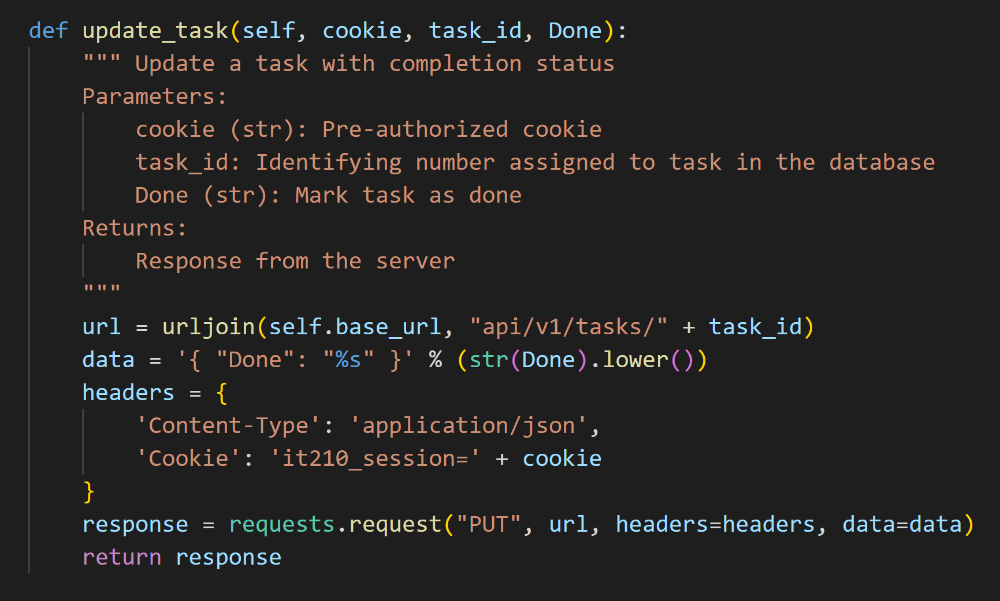
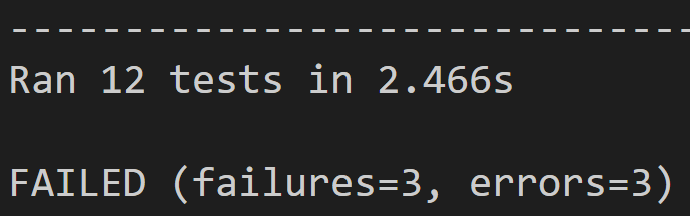
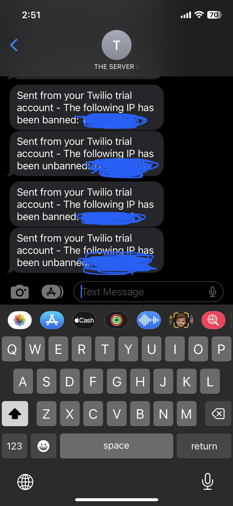

# Zac Conlin - 16 November - Lab 5

## II. Executive Summary:

In this two part lab, I first created an API to test various functions in a python script. For the second part I created a system to ban malicious IP addresses by utilizing Fail2Ban, and supported it by writing a Python script to send an admin a text whenever an IP is banned.

## III. Design Overview:

I started by writing and documenting functionality for several CRUD functions, because in order to create a test API script I needed something from which to test. These functions created, read, updated, and deleted tasks, as well as identified users. From there, I would run these functions against several provided databases to ensure that each of them work in any scenario.

I then created a test_api with twelve test cases in order to test the implementation of my functions. Running these with the data provided in four separate servers, I would get a large range of potential outcomes, errors, and failures. These failures were what I was looking for, testing for things like extra parameters, missing parameters, strings that don't match requirements, etc.

These tests are clearly documented so that a different developer could use them and understand what to do with them, for example:

The tests weren't written to always come back true, if they catch something incorrect, they will point to what function failed and why the likely reason it did so.

Here is an example of this happening:

Here is the output when many failed tests exist, it is easy to tell how many there should be:

The second part of the lab involved creating "jails" for various actions which identify an IP address as malicious. For example, included is a test jail that will ban anyone who attempts to go to an endpoint with the word "hacker" in it. 

While humorous, this was an introduction to be able to create a custom jail. I chose to do one that blocks all access to phpmyadmin that don't come through my own laptop's IP address, inspired by one of my friends who shoulder surfed my phpmyadmin dev password and used it to log into it on his own computer.

Using regex, I allowed my own IP address, then created that jail to block everybody else from accessing it. I then used Twilio to send myself texts whenever an IP gets banned using a python script. This script makes use of env variables that protect my personal data (like auth tokens and phone numbers) from being out there and visible to the public.

Here is my custom jail:

These are the logs that prove that an IP had been banned:

Here are the texts that the API will send me when an IP is banned/unbanned:

## IV. Questions:

### Lab 5 Questions

*Name and discuss at least two of the benefits of writing unit tests before writing code.*
    
Writing the test before the code helps the developer to stay on task and focused as they code. Then once the test passes, then the code is done, and there is much less chance of falling down rabbit holes.

*What would be some of the benefits of automating your test scripts (i.e. so they run at each commit)?*

Then you wouldn't even have to think about the test scripts, they just would run in the background and throw errors if/when they catch them. That way, a developer wouldn't keep working on a product that had an issue hours ago, but they never caught it because they didn't think to run the test scripts.

*How long did this lab take for you?*

This lab took somewhere between fifteen and eighteen hours over the course of the last week

## V. Lessons Learned:

*Problem 1*

If the functions and tests are working fine one day, but the next throw errors about being unauthorized, the cookie has likely expired. Go to the server and grab the new cookie, then update it in the tests and it should be working again.

*Problem 2*

After testing the python script on the machine it was written on, even if it works, it will not work for the server yet because it isn't in the server. To fix this, create a new file on the live server, and copy the python script over. It is now accessible via this new path on the server.

*Problem 3*

If the environmental variables won't read properly between the .env file and the script, ensure that the `from decouple import config` line is included at the top. This will allow the config to access the environment variables.

## VI. Conclusions:

### Skills Acquired
- Create and test functionality in python
- Create filters and jails for malicious IPs
- Interface with Twilio API

### References
Helpful tutorial on sending an sms through a script - https://www.twilio.com/docs/sms/tutorials/how-to-send-sms-messages-python#send-an-sms-message-in-python-via-the-rest-api

How to use python-decouple - https://simpleisbetterthancomplex.com/2015/11/26/package-of-the-week-python-decouple.html

Python syntax help - https://www.w3schools.com/python/