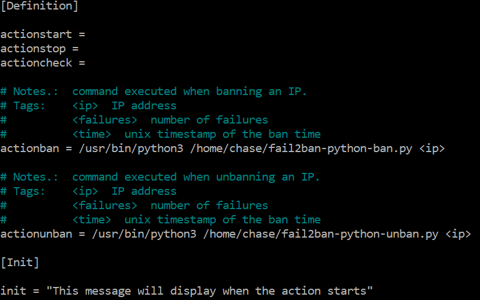

# Server Hardening and Regex

## Introduction

This lab is to help you prepare your server to be attacked and monitored. You'll be implementing a program that'll protect the server against password brute forcing. With the logs it generates, you'll do some system administrative tasks to email the banned IP addresses to your network operation center (NOC) team. Using Regex, you'll parse through logs looking for specific phrasing and IP addresses to monitor a system's security.

Prerequisite: Check that you have Apache2 running by visiting your IP address at port 80 (e.g. 192.168.90.1:80) OR running `sudo service apache2 status`. If you do not have Apache2 running on your AWS live server, please install it with `sudo apt install apache2`.


## Step 1: Install Fail2Ban and UFW

Fail2Ban is a popular administration tool that can protect servers from brute-force password guessing, DoS, and other attacks. It scans log files and bans IP addresses that make too many password failures. Read more [here](http://www.fail2ban.org/wiki/index.php/Fail2Ban).

UFW (**U**ncomplicated **F**ire**W**all) is a frontend for the built-in firewall for Linux—`iptables`—that provides users with an easier and simpler way to create firewall rules. Read more [here](https://wiki.ubuntu.com/UncomplicatedFirewall). All the following steps should take place on your live server.

1. Install Fail2Ban and UFW:

    ```bash
    sudo apt update
    sudo apt install fail2ban ufw
    ```

    Do NOT enable UFW until you allow ssh in the next step or else you will lock yourself out of your live server

2. Set UFW permissions

    ```bash
    sudo ufw allow ssh
    sudo ufw allow apache
    sudo ufw allow 1337 # (for your future node server)
    ```

    Ensure UFW outputs "Rules Updated / Rules Updated (v6)" after each command

3. Enable UFW

    ```bash
    sudo ufw enable
    ```

4. View UFW rules
   ```bash
   sudo ufw status
   # (should have port 22, Apache, and port 1337 ALLOW from Anywhere)
   ```

## Step 2: Create a Custom Jail (10 points)

1. Configure Fail2Ban

    In Fail2Ban, `.local` files take precedence over `.conf` files. Because of this, we will make copies of the `.conf` files and edit the new `.local` files, leaving the `.conf` files untouched.

    ```bash
    sudo cp /etc/fail2ban/fail2ban.conf /etc/fail2ban/fail2ban.local
    sudo cp /etc/fail2ban/jail.conf /etc/fail2ban/jail.local
    ```

2. Jails can be found at `/etc/fail2ban/jail.local`

    Read over the comments at the top of this file. They are very helpful for understanding how this file works. More information about the default jails and how they work can be found [here](https://docs.plesk.com/en-US/obsidian/administrator-guide/server-administration/protection-against-brute-force-attacks-fail2ban/fail2ban-jails-management.73382/).

3. Whitelist your IP

    Open `jail.local` and look for the `[DEFAULT]` jail. Make sure you cannot be banned by adding your IP address to the `ignoreip` variable.

    > Note: when you can access your live server through your EC2 instance IP address, whitelist your public IP address, which can be found using a tool like [ipinfo.io](https://ipinfo.io/ip).

4. Find Apache connection logs

    Apache is configured to store logs at `/var/log/apache2/`. You can view a live output of your Apache connections using:

    ```bash
    sudo tail -f /var/log/apache2/access.log
    ```

    With that command running, visit your Apache server. (This should be your live server's IP address on port 80.)

    Your request should show up in the terminal from the `tail` command. We will use these access logs to search for IP addresses to block. Use <kbd>Ctrl-c</kbd> to end the live log view.

5. Create a jail regex

    Fail2Ban uses "jails" to detect malicious connections and deal with them. Pre-configured jails can be found in `/etc/fail2ban/filter.d/`

    > Note: These jails can be enabled in `jail.local` by scrolling down to the jail that you want to enable (in the square brackets) and typing `enabled = true`

    Since we will be creating our own jail, create a file in `/etc/fail2ban/filter.d/` called `testJail.conf`. Inside of `testJail.conf`, we will place a regex that will trigger this jail. To do this, paste in the following code:

    ```conf
    [Definition]
    failregex = ^<HOST> -.*hacker.*$
    ignoreregex =
    ```

    The `failregex` uses regular expressions to flag the connections that we tell it to. In this case, it will be looking at our Apache access logs which start (`^`) with the user's IP address (Fail2Ban uses `<HOST>` for this part), then a space and dash (` -`), any characters (`.*`), and then any part of the log that says "hacker" (`hacker`). A good introduction to regex can be found [here](https://www.computerhope.com/jargon/r/regex.htm).

6. Configure the jail settings

    Edit `/etc/fail2ban/jail.local` and scroll down to the `JAILS` section. Above the SSH servers section, create a jail named `[test-jail]`. Following the syntax of the other jails below, set the following variables:

    ```conf
    # Turns on the jail
    enabled = true
    # Only listen to port 80 (the HTTP port)
    port = 80
    # Name of our test jail configuration file
    filter = testJail
    # Path to the log we will watch
    logpath = /var/log/apache2/access.log
    # Ban after 2 offenses
    maxretry = 2
    # The user will be banned for 60 seconds
    bantime = 60
    # Max retry counter will be reset to 0 after 180 seconds
    findtime = 180
    ```

7. Restart Fail2Ban

    ```bash
    sudo service fail2ban restart
    ```
    Check its status:
    ```bash
    sudo service fail2ban status
    ```
    If it is not active (running), then you probably have a syntax error in your config files

8.  Verify the your new jail is running

    ```bash
    sudo fail2ban-client status
    ```
    If you see `test-jail`, then it is actively looking for a user to ban!

9.  Test the jail
    1. Pull up a live view of your Apache access log using `tail`
    2. Visit your server on any device where your ip is not whitelisted (Your phone could work for this).
    3. From that same device, visit the `/hacker` endpoint two times. You should see this request also show up in your access log.
    4. Refresh the page again. If you get a failed connection or a 502 error, then you have been blocked!

    You can check how many people are banned by a specific jail with:

    ```bash
    sudo fail2ban-client status test-jail # or any jail name
    ```

    Run `sudo less /var/log/fail2ban.log`. Scroll to the bottom and __*screenshot*__ the `test-jail` ban activity.

TIP: If you want to unban an IP, use `sudo fail2ban-client set <JAIL> unbanip <IP>`

## Step 3: Make Your Own Jails (30 points)

Using the steps from Step 3, create two jails of your own. There are many different rules that you can enforce using Fail2Ban. For example, if somebody gets a 404 server response code 10 times in one minute, they probably aren't up to any good. To enforce this rule, you would create a regex that searches for the numbers "404" and flag it. By setting `maxretry` to 10 and `findtime` to 60 for this jail, you would be able to catch bad actors trying to brute force your website, searching for endpoints.

Other jails could be:
- Blocking connections from an iPhone
- Blocking connections from Safari
- Blocking a specific IP or range of IPs
- Preventing DoS attacks
- Block people trying to get to an admin page
- etc.

Another cool feature on the jails is the `ignoreregex` filter. If a log triggers a jail, but then is caught by `ignoreregex`, then the user is not banned. For example, if a user tries to access `/admin`, they should be blocked unless they ARE an admin. If you place your IP address into an `ignoreregex`, then you won't be blocked! If you implement an `ignoreregex` statement into your jail, then you only need to do one custom jail.

When creating a regex, copy a few lines from your Apache access log and paste them in an online regex tester, like [regex101.com](https://regex101.com). If the whole line gets selected from your regex, then it will be caught by the Fail2Ban. When you are sure that your regex will catch the correct logs, use Fail2Ban's `<HOST>` tag so it can capture the IP address of that log (for Apache it is the very first item in each line). This is what you did in `testJail.conf`. After your regex is complete and the `<HOST>` tag is properly inserted, place the entire expression into your new custom jail configuration file.

You must prove that your jails work by running it through the built-in Fail2Ban regex tester. This is done by running this command:

```bash
# usage: sudo fail2ban-regex <LOG> <REGEX> [IGNOREREGEX]
sudo fail2ban-regex /var/log/apache2/access.log /etc/fail2ban/filter.d/<YOUR JAIL>.conf
```

This will show the Apache log lines that matched your regex.

If you have an `ignoreregex`, use the above command and the following command:

```bash
sudo fail2ban-regex /var/log/apache2/access.log /etc/fail2ban/filter.d/<YOUR JAIL>.conf /etc/fail2ban/filter.d/<YOUR JAIL>.conf
```

This will show you the Apache log lines that matched your regex and were then ignored by the `ignoreregex`.

If the output makes sense, __*screenshot*__ the results of the regex tester. Then restart Fail2Ban, check the active jails, and run a live test (part 9 on Step 3). If the live test functioned correctly, run `sudo less /var/log/fail2ban.log`, scroll to the bottom, and __*screenshot*__ the logs that show the banned IP for each of your custom jails.

## Step 4: Python Script Triggering (40 points)

While it is helpful to block IP addresses that are conducting suspicious activity, it is important that a system administrator stays informed with when and why Fail2Ban is blocking people. This part is meant to be a little open ended and we hope that you get a creative with it.

Custom actions can be used to run scripts when a jail is triggered. This can be done by adding `action = action_name` to your custom jail in `jail.local`. To keep the default ban action when your jail is triggered, add the following two lines:

```
action = %(action_)s
         action_name
```

The first line will call the default ban-action and the second line will call your custom action. Make sure that it is indented over (with spaces, not tabs) to match the spacing above. When adding your custom action name, do not include the `.conf` that appears in your `action.d` directory.

Like custom jails, you can create custom actions in `/etc/fail2ban/action.d`. Read over the following custom action file and its comments to get a feel for how it all works:



- `actionstart` runs a command when the Fail2Ban process starts
- `actionstop` runs a command when the Fail2Ban process stops
- `actioncheck` runs a command every time the jail is triggered
- `actionban` runs a command when an IP is banned
- `actionunban` runs a command when an IP is unbanned

In this example, a Python script is run when a user is banned or unbanned and the IP address of the offender is passed as an argument to each script. For Fail2Ban to start back up, you must have a file at the file path given in each action. After a custom action is made and the custom jail is edited, make sure to restart Fail2Ban with sudo service fail2ban restart.

For a little more help, [here](http://toon.io/fail2ban-send-sms-user-banned/) is a simple writeup that explains how somebody configured Fail2Ban to send them a text message when their jail was triggered. Notice this example does not use python. You will use python to write your script so do not copy this example exactly. 

# Server Hardening and Regex – Pass-off

- [ ] There are no connection strings or personal information in the screenshots or code uploaded to GitHub
- [ ] Demonstrate your python script works properly. 

Document your server hardening by editing [the `README.md` file](../README.md) at the root of this directory. It must include the following:
- [ ] Screenshot of the Fail2Ban log showing the `test-jail` ban activity
- [ ] Include your custom jails (the relevant lines from `jail.conf` and the filters you made in `filter.d`) with comments for each line and explain why an administrator would want to implement this in a production environment.
    > Note: You may copy the text in instead of a screenshot, or with it, if you prefer
- [ ] Screenshots of `fail2ban-regex` command and Fail2Ban log showing your custom jail(s) ban activity.
- [ ] Include your custom Python script that is called when your jail is triggered and explain why it would be useful to an administrator
    > Note: You may copy the text of the script instead of a screenshot, or with it, if you prefer


